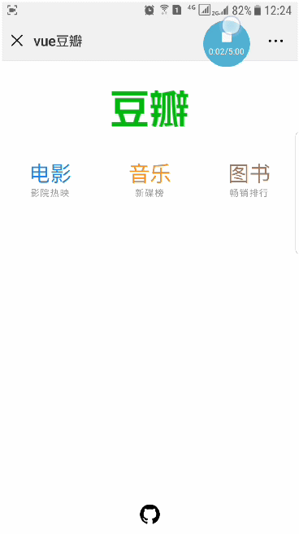
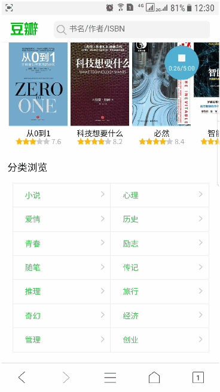

# 豆瓣Vuejs版

<p align="center">
预览
</p>
<p align="center">
    
    
    
</p>

<p align="center">
扫码体验
</p>
<p align="center">
	
</p>

## Build Setup

``` bash
# install dependencies
npm install

# serve with hot reload at localhost:8586
npm run dev

# build for production with minification
npm run build

# build for production and view the bundle analyzer report
npm run build --report
```
